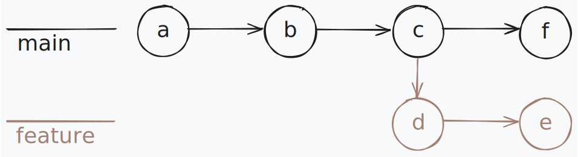
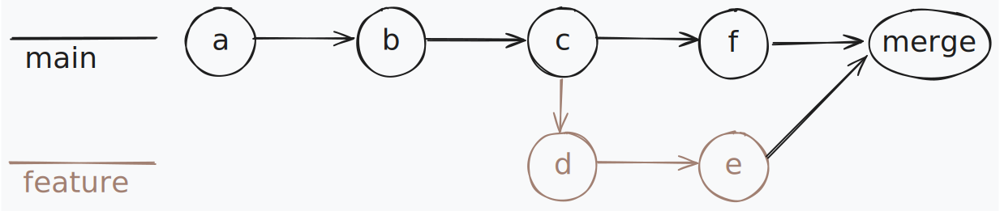
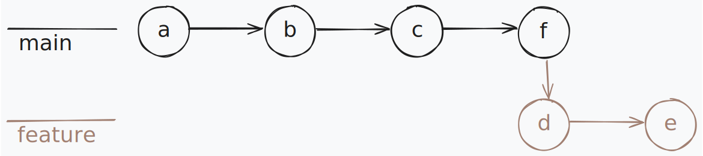

# Git rebase

## merge vs rebase

- **merge**

  - vytvoří nový "merge commit", který spojí změny z jiných větví do cílové větve
    

- **rebase**
  - mění historii tím, že přepisuje commity. Commity přesouvá na nový základ (např. HEAD)
    

## interactive rebase

Interaktivní rebase nabízí možnosti pro detailní úpravu historie commitů v rámci jedné větve.
Používá soubor nazvaný TODO, který obsahuje všechny commity od nového základu, každý na novém řádku.
Před každým commitem je příkaz, který určuje, co s ním dělat (výchozí je pick).
Commity a příkazy se přehrávají shora dolů a lze je i přeuspořádat.

### Příkazy v TODO souboru

- `pick`: použije commit beze změny.
- `reword`: použije commit, ale umožní změnit jeho zprávu.
- `edit`: zastaví rebase a umožní změnit obsah commitu. Po úpravě pokračuje `git rebase --continue`.
- `squash`: sloučí commit s předchozím, zprávu lze upravit.
- `fixup`: sloučí commit s předchozím bez možnosti upravit zprávu.
  - `-C`: použije se zpráva tohoto commitu.
  - `-c`: umožňuje zprávu commitu upravit, podobně jako u `reword`.
- `exec`: spustí příkaz.
- `break`: přeruší rebase.
- `drop`: odstraní commit z historie.
- `label`: přiřadí commitu label.
- `reset`: přesune aktuální HEAD na commit nebo label.
- `merge`: vytvoří "merge commit" s zadaným commitem/labelem a aktuální HEAD.
- `update-ref`: aktualizuje referenci, aby ukazovala na tento nový commit. Aktualizace probíhá na konci rebase.

### Undo

Změny lze vrátit pomocí `reflog`. Nejprve najdeme záznam před `HEAD@{x}: rebase (start)`, a poté stačí použít `git reset --hard "@{x - 1}"`. Pozor, že `git reset --hard` odstraní všechny lokální změny. Pokud jsme rebase ještě nedokončili, můžeme místo toho použít příkaz `git rebase --abort`.

### `git commit --amend` vs `git rebase --continue`

Pokud jsme použili příkaz `edit`, po provedení změn použijeme `git commit --amend`.
Pokud jsme narazili na `merge conflict`, po odstranění konfliktu použijeme `git rebase --continue`. Pokud jsme ale omylem provedli `git commit`,tak vytvoří se extra commit.

### Slučování a rozdělování commitů

Slučování commitů je jednoduchá operace, kterou můžeme například provést příkazem `squash` v TODO souboru. Rozdělování commitů rozdělování commitů lze několika způsoby například pomocí [`rebase`](https://github.com/kimgr/git-rewrite-guide?tab=readme-ov-file#split-a-commit).

### Merge commity

Pokud provádíme rebase na commity, mezi kterými je merge commit, budeme muset znovu vyřešit `merge conflict`, ale merge commit po rebase již nebude v historii commitů. Pokud chceme merge commity zachovat, můžeme použít přepínač `--rebase-merges`, který přidá merge commity do TODO souboru.

## Zdroje

- [Blog](https://jvns.ca/blog/2023/11/06/rebasing-what-can-go-wrong-/)
- [Git](https://git-scm.com/docs/git-rebase)
